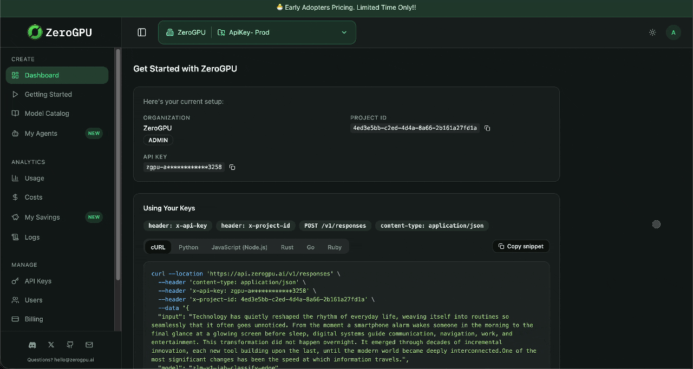

  

<h1 align="center">ZeroGPU</h1>

  <strong>Distributed AI inference for geo-aware edge compute.</strong> 
  Run production workloads with lower cost and lower latency — horizontal scale across edge devices, one familiar API surface.

  
  &nbsp;
  
  &nbsp;
  

  
  
  
  

  

---

## Why ZeroGPU

- **Lower cost** — Inference on idle edge compute instead of always renting centralized GPU capacity.
- **Geo-aware routing** — Requests land on nearby capacity so latency stays predictable for real users.
- **Edge-native models** — Nano language models (NLMs) tuned for edge and cloud, not only downsized cloud stacks.
- **OpenAI-compatible API** — `POST /v1/responses` and `POST /v1/chat/completions` with request shapes you already know.
- **Cloud fallback** — When edge is unavailable, the same API path falls back to cloud without a second integration story.
- **Typed SDKs** — Official clients on [npm](https://www.npmjs.com/package/zerogpu-api) (`zerogpu-api`) and [PyPI](https://pypi.org/project/zerogpu-api/) (`pip install zerogpu-api` → `import zerogpu`), plus Go, Ruby, Java, Rust, C#, PHP, and Swift in the [**SDK**](https://github.com/zerogpu/SDK) monorepo.

---

## API at a glance

| | |
| --- | --- |
| **Base URL** | `https://api.zerogpu.ai/v1` |
| **Primary path** | `POST /v1/responses` |
| **Headers** | `x-api-key`, `x-project-id`, `Content-Type: application/json` |
| **Reference** | [Responses API](https://docs.zerogpu.ai/api-reference/endpoint/responses) |

Set `ZEROGPU_API_KEY` and `ZEROGPU_PROJECT_ID` the same way you do in the platform dashboard snippets. Full authentication, models, and error semantics live in **[docs.zerogpu.ai](https://docs.zerogpu.ai)**.

---

## Highlighted repositories

| Repository | What you’ll find there |
| --- | --- |
| [**zerogpu/SDK**](https://github.com/zerogpu/SDK) | Official Fern-generated API clients, smoke tests, and publishing workflows for npm/PyPI packages. |
| [**zerogpu/docs**](https://github.com/zerogpu/docs) | Documentation source and deep links into [docs.zerogpu.ai](https://docs.zerogpu.ai). |
| [**zerogpu/zerogpu-router**](https://github.com/zerogpu/zerogpu-router) | Router-related components that pair with how traffic and capacity are orchestrated. |

---

  ZeroGPU — inference where your users are, not only where the GPUs are.

